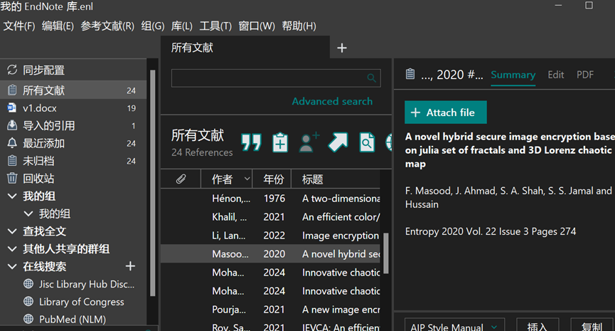
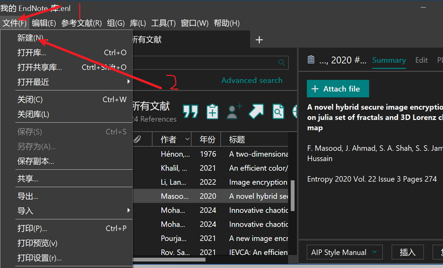
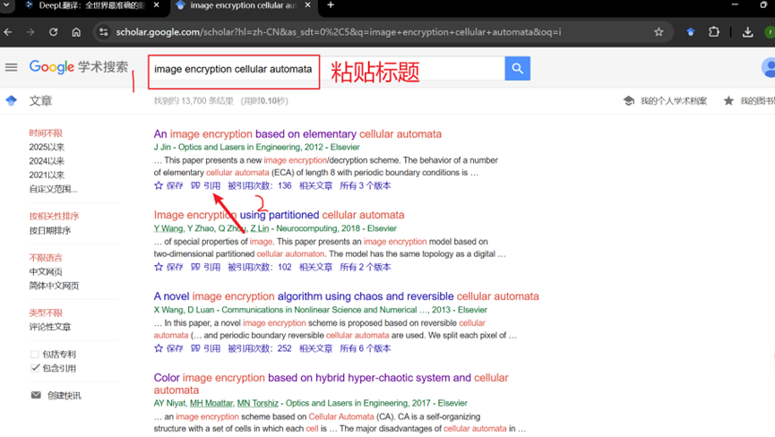
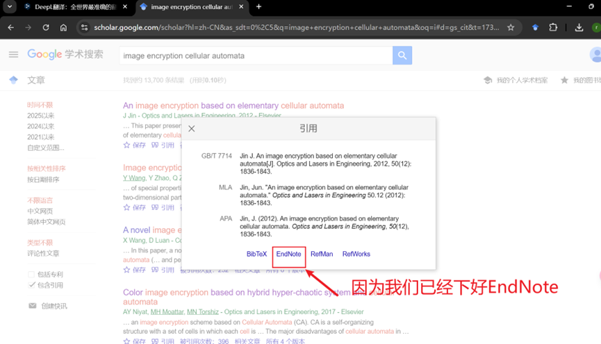
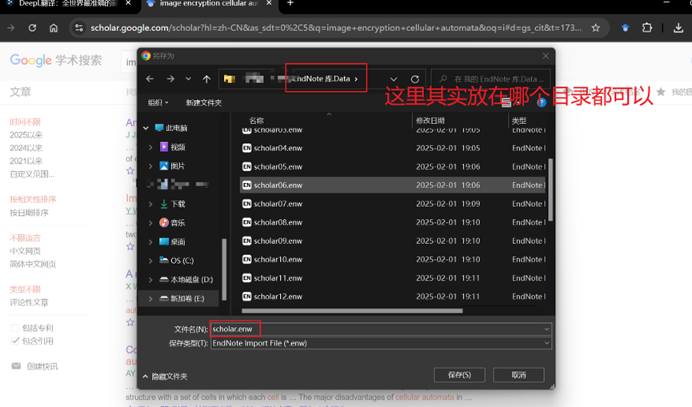
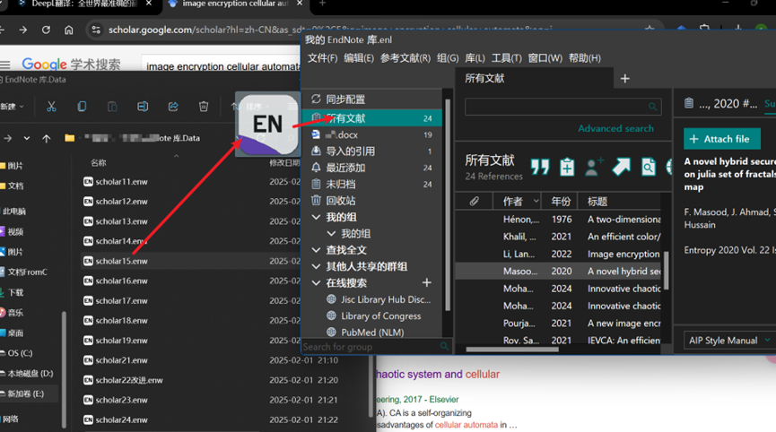
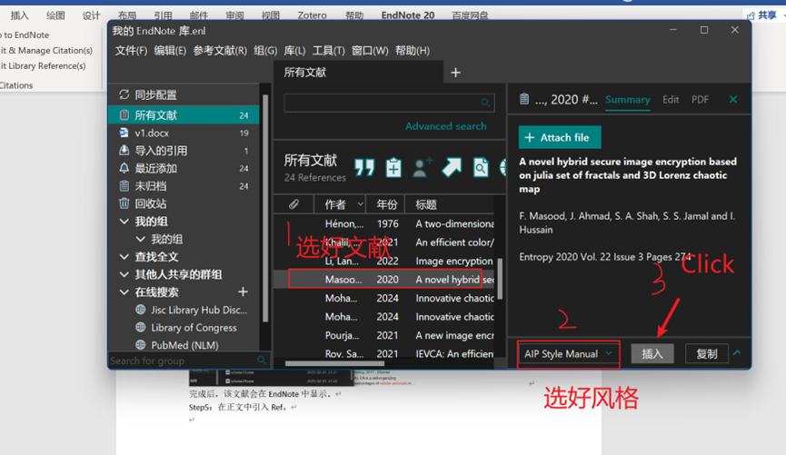

## 所需背景

你已经会使用某些工具进行科学上网的前提下（不要忘记打开 VPN），并且你的电脑已经安装了 EndNote！
下面请打开你的EndNote：
背景是这样的（这里本人论文中已经引用的，请忽略！）

---

## 步骤

### Step 1：新建库

在 EndNote 中创建一个新的库（Library），用于存储论文中的参考文献。

---

### Step 2：打开 Google Scholar

按照以下步骤完成设置：

1. 进入 [Google Scholar](https://scholar.google.com/)。
2. 在设置中调整格式，以便导出适用于 EndNote 的引用。

---

### Step 3：下载引用文件

> **注意**：这里下载的不是文献全文，而是引用文件。

---

### Step 4：导入 EndNote

下载完成后，将件拖拽至 EndNote，文献条目将会自动添加到你的库中。

---

### Step 5：在 Word 中引用文献

1. 打开 Word，使用 EndNote 插件插入引用。
2. 选择合适的引用格式（如 APA、IEEE）。
3. 确保所有引用的文献都已正确导入。

---

## 结语

> 纸上得来终觉浅，绝知此事要躬行。

**By Dongran**

## Did you find this page helpful? Consider sharing it 🙌
