# 如何在 LaTeX 环境中引用 Reference

本文介绍在撰写英文论文时，使用出版社提供的 LaTeX 模板进行文献引用的方法。

---

## 步骤 1：寻找 Reference

在查找文献时，可以使用 **EndNote**、**Zotero** 等文献管理软件获取引文名。例如：
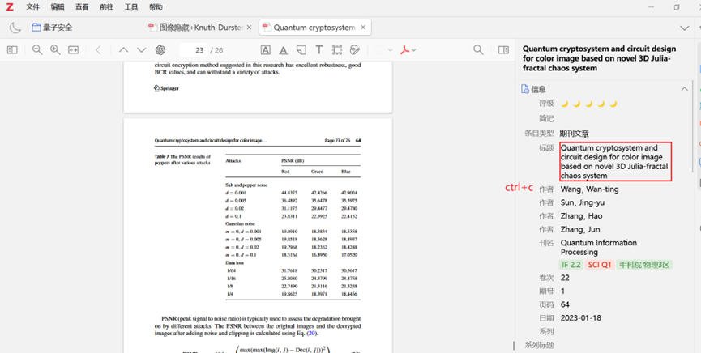
1. 复制引文名后，在 **Google Scholar** 中粘贴搜索。
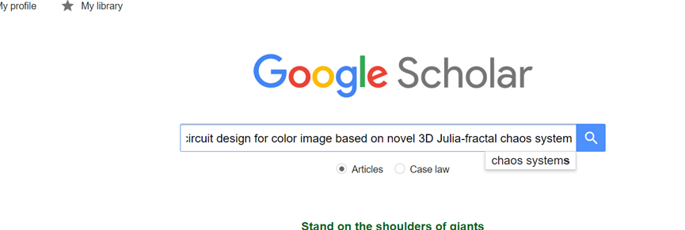
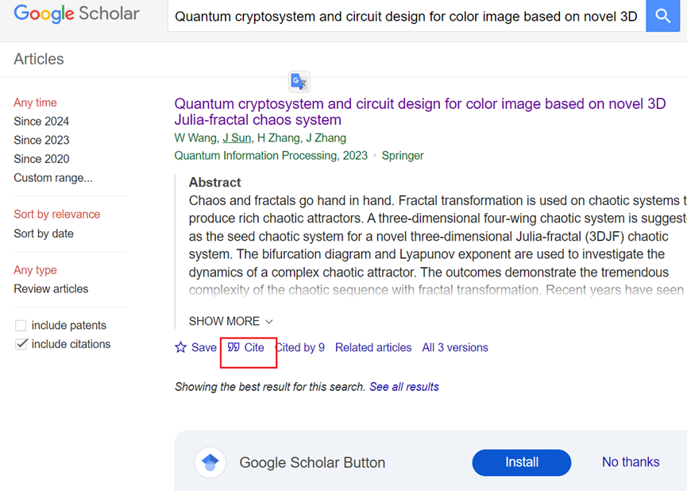
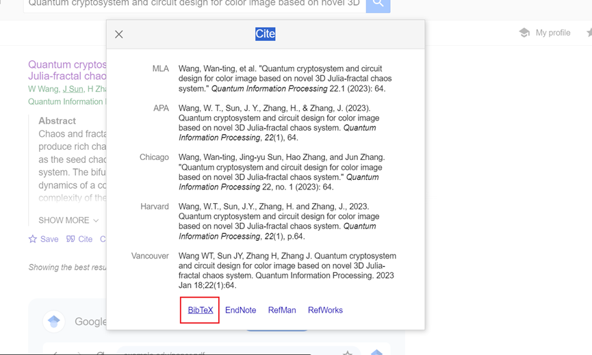
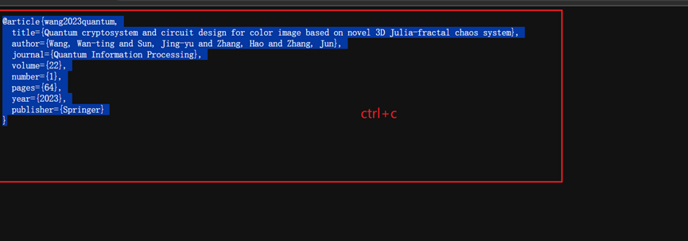
2. 如果只知道 **DOI 号**，但不知道文献名，可以访问 [AbleSci](https://www.ablesci.com/) 进行查询。
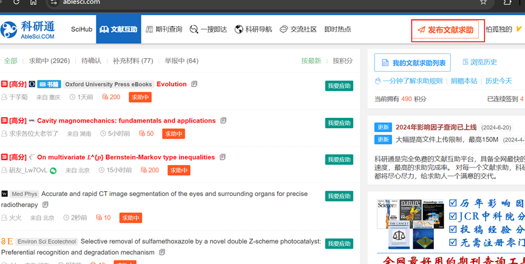
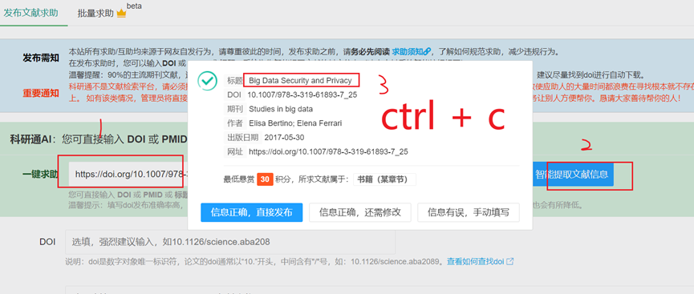

---

## 步骤 2：创建 LaTeX 项目

在 **Overleaf**、**TexPage** 等在线 LaTeX 编译器中，新建一个项目，并创建 **2 个文件**：
- `BibTex.bib`
- `BibTexRf.bbl`
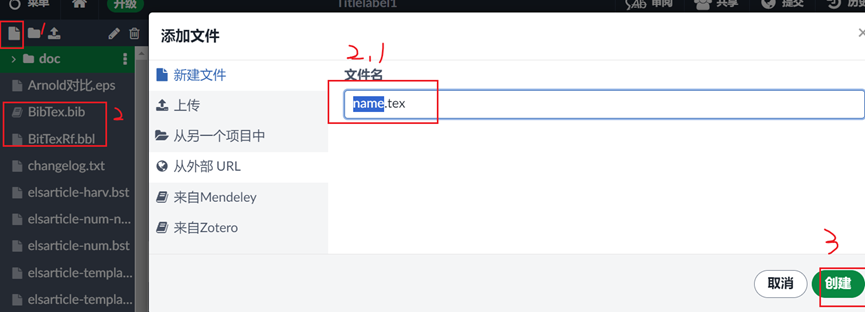
在BibTex.bib文件中粘贴步骤复制的内容
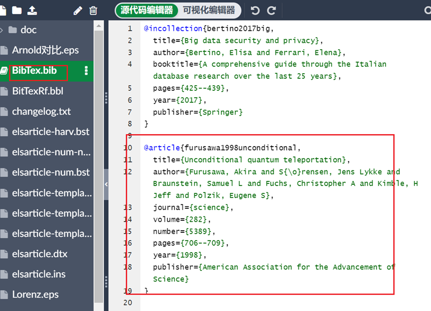

---

## 步骤 3：添加引用

1. 在 `BibTex.bib` 文件中粘贴 **步骤 1** 复制的参考文献信息。
2. **注意**：LaTeX 编译时，文献的排列顺序依赖于 `.bib` 文件中文献的先后顺序。
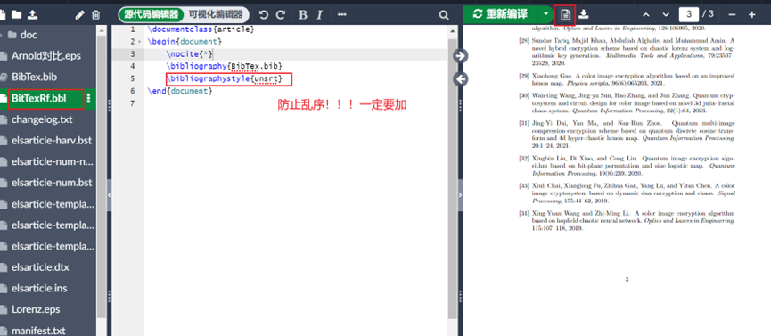
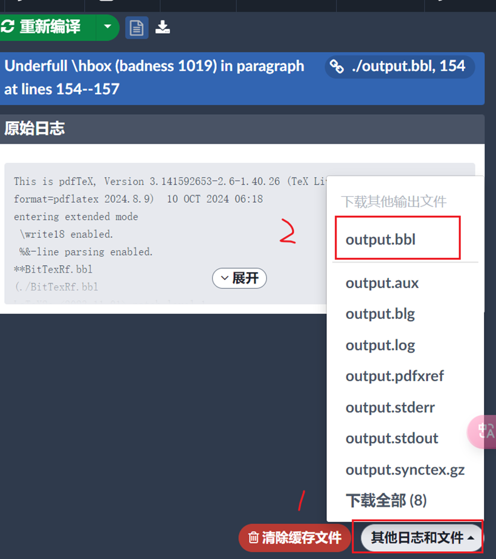

---

## 步骤 4：编译 `.bbl` 文件

1. 在 `BibTexRf.bbl` 文件中写入正确的 BibTeX 代码，然后进行编译。
2. **可能遇到的问题**：
   - **Repeat entry**（重复条目）：导致只能编译出一个引文。
   - **解决方案**：修改属性名。例如：
     ```bibtex
     @article{wang2020imageEncryption,
       author = {Wang, XX and Li, YY},
       title  = {Image Encryption Method},
       year   = {2020},
       journal= {Science Journal}
     }
     ```
   - 将 `wang2020image` 改为 `wang2020imageEncryption`，避免重复。
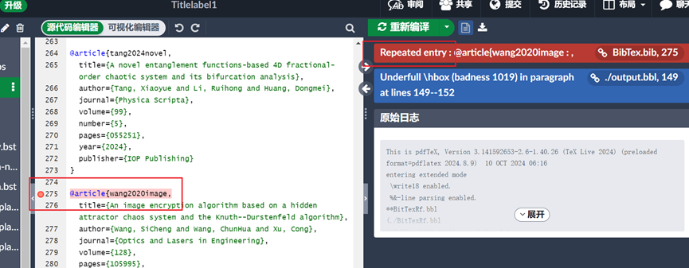


---

## 步骤 5：在模板中加入参考文献

1. 编译完成后，导出 `.bbl` 文件。
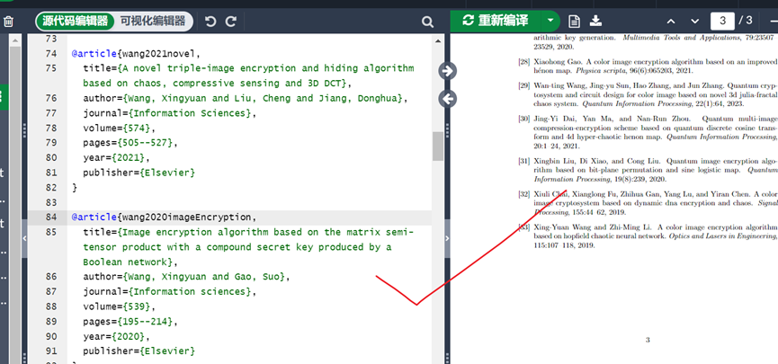
2. 在 **桌面右键** 用 **记事本** 打开（系统默认可能无法直接打开）。
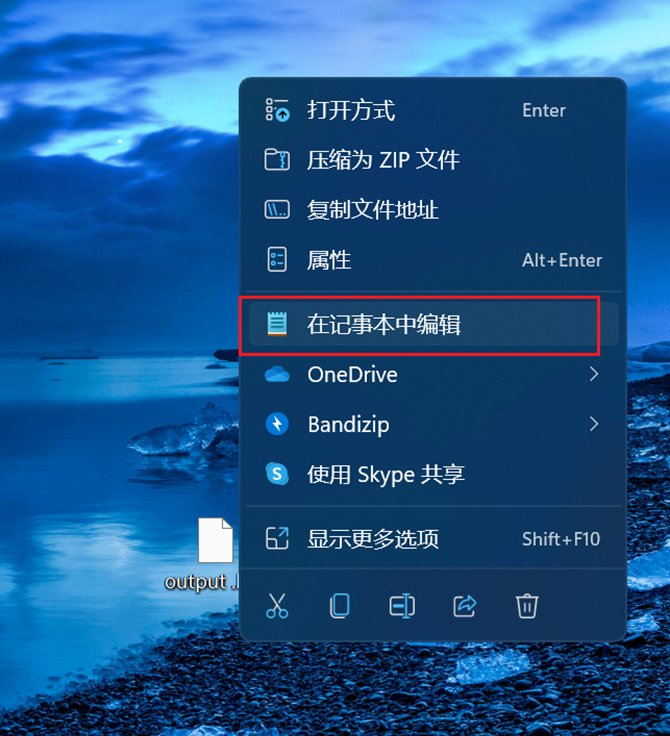
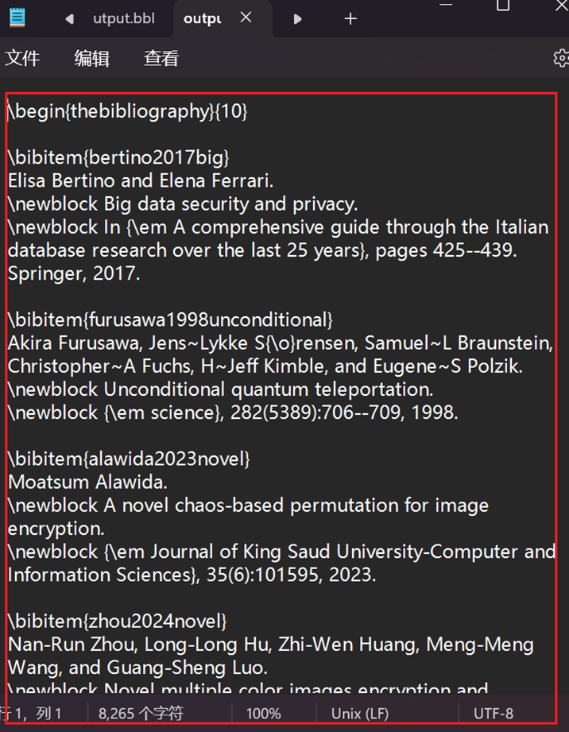
3. **复制全部内容** 并粘贴到 `.tex` 文件末尾。
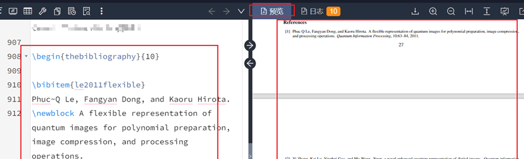


---

## 步骤 6：在文章中引用参考文献


- **单一引用**：
  ```latex
  \cite{wang2020imageEncryption}
- **多重引用（如 [7-11]）**：
  ```latex
  \cite{ref7, ref8, ref9, ref10, ref11}


## Did you find this page helpful? Consider sharing it 🙌
